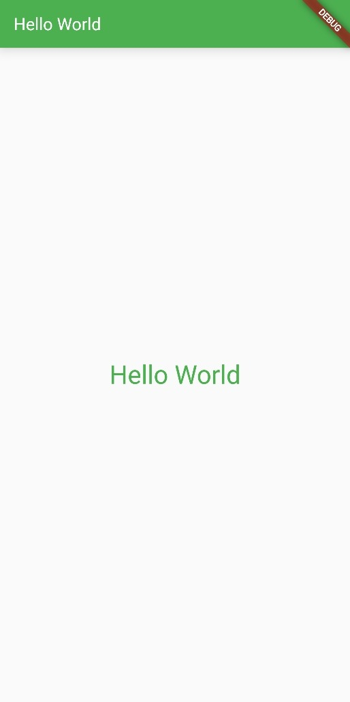
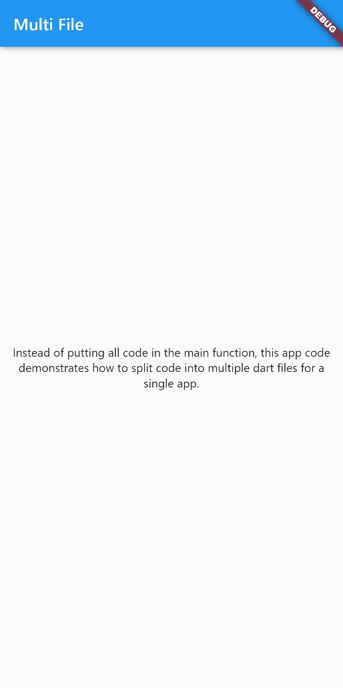
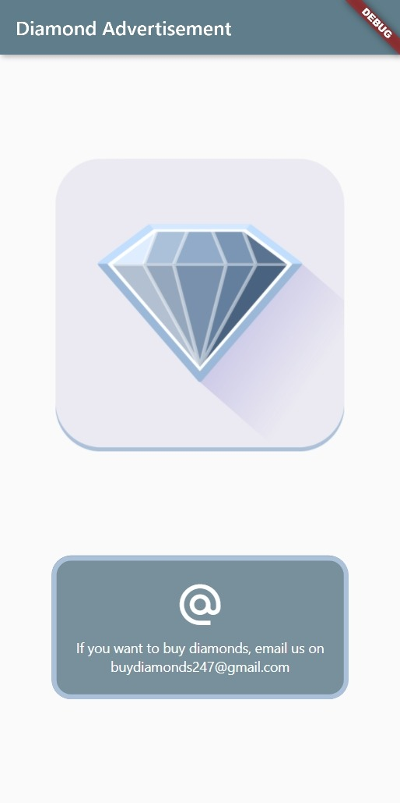
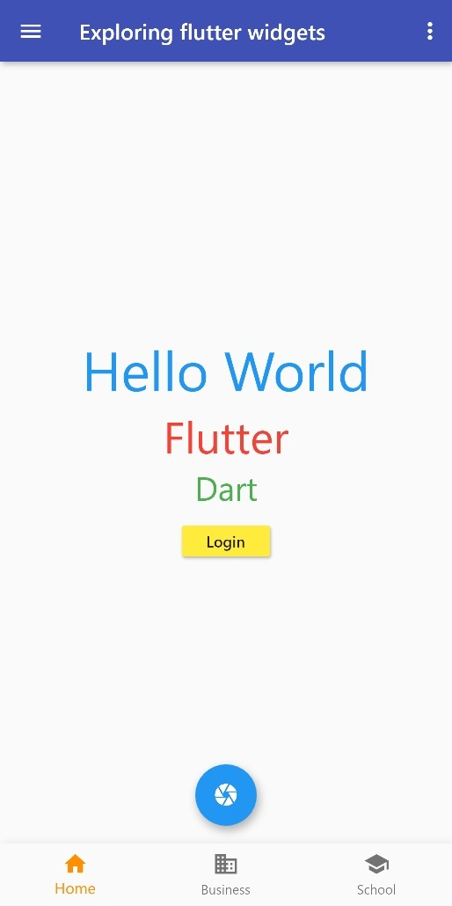

# Flutter & Dart Fundamentals
Handcrafted basic apps for getting started with flutter and dart.

| [Hello World](hello_world)  | [Multi file app](multi_file_app) | [Counter app](counter_app)  |
|:-:|:-:|:-:|
|   |  |   |

| [Diamond advertisement](diamond)  | [Contact us](contact_us) | [Exploring Flutter Widgets](exploring_flutter)  |
|:-:|:-:|:-:|
|   |  |  |

> [See this gist](https://gist.github.com/sourhub226/cc9538ec0a4818b454ce7b4459bce524) for Dart programming examples with outputs.
